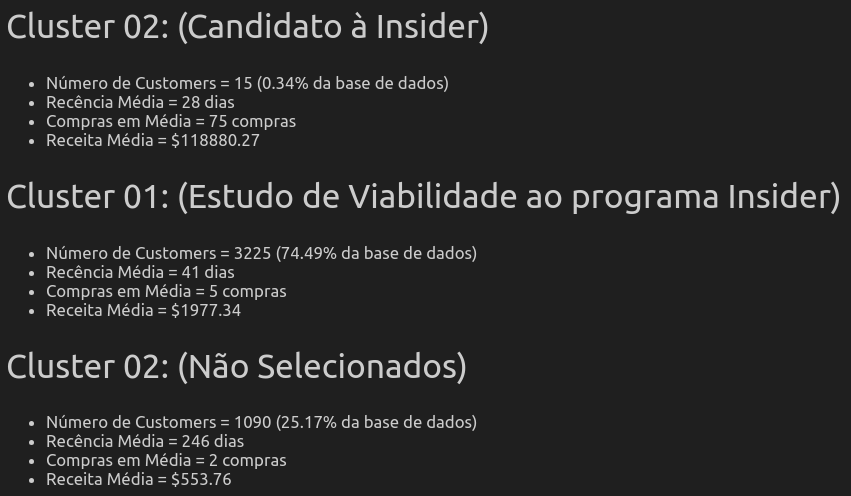
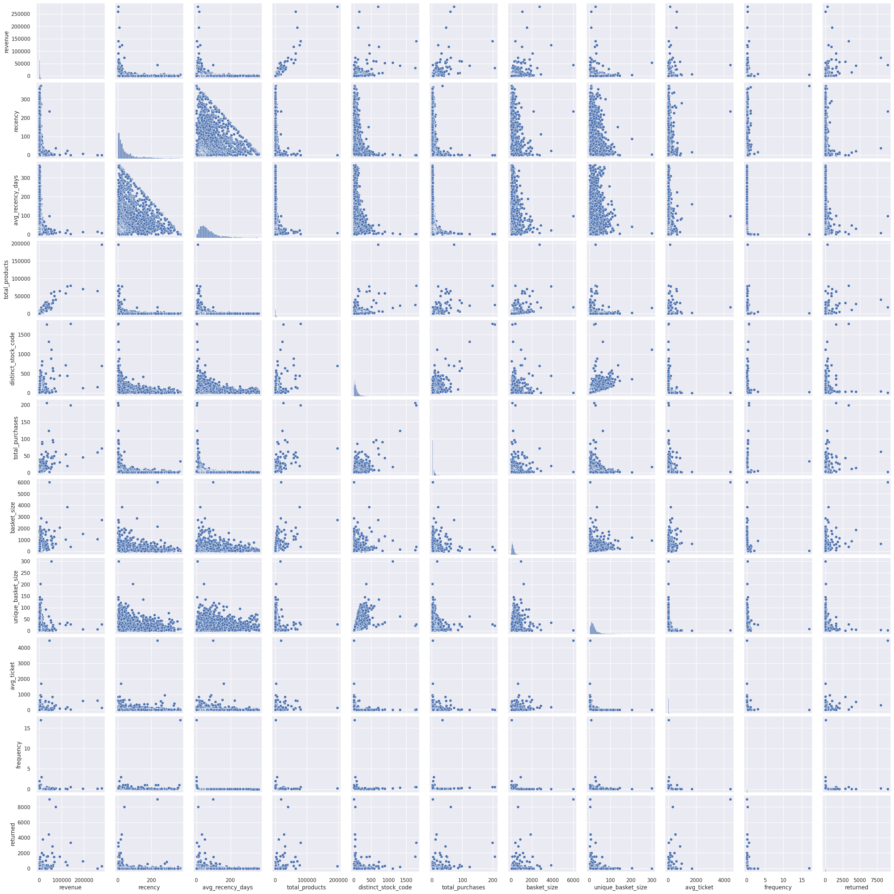
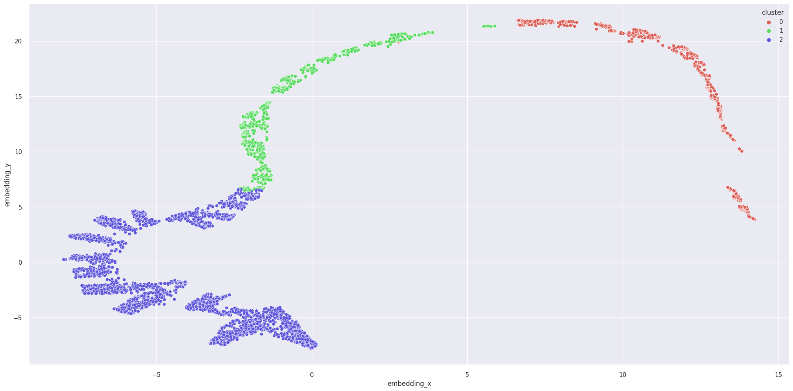
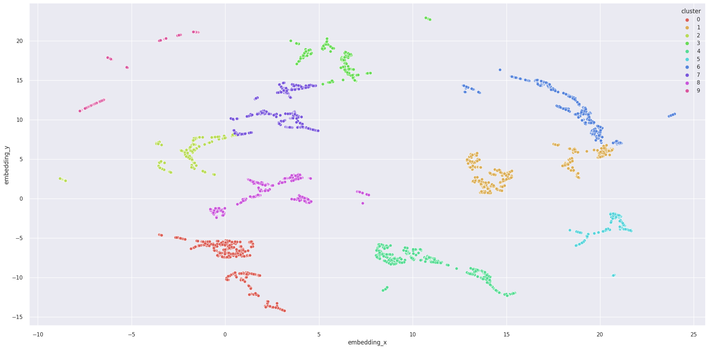
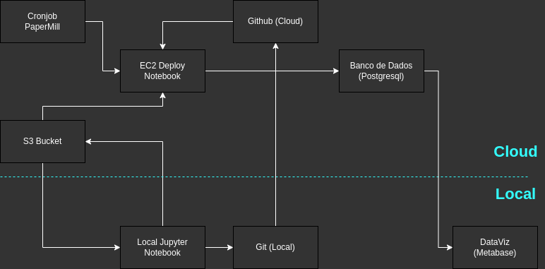

#   5.0 CICLOS DE DESENVOLVIMENTO

____

##  5.1 Ciclo 1 - Modelo RFM e Métricas de Validação de Cluster

**1.    Tratativas iniciais dos dados**

*   Foram desconsideradas colunas com dados faltantes para customer_id, bem como também foram desconsideradas entradas com valor de preço ('unit_price') e quantidade('quantity') negativos. Tal decisão foi pautada na escolha de realizar esse ciclo com a finalidade de observar o comportamento da maior parte da base de dados original.
*  A coluna 'invoice_date' teve seu tipo alterado de _object_ para _datetime64_ seguindo formato 'Y%-m%-d%'. **Essa alteração será adotada como padrão para os ciclos de desenvolvimento posteriores.** 

**2.  Modelo RFM - Feature Engineering**

O primeiro ciclo do projeto foi desenvolvido com o objetivo de obter maior clareza quanto a visualização da disposição inicial de dados. Para tanto, criou-se uma nova base de dados a partir dos dados númericos da base original ('Quantity' e 'UnitPrice') de acordo com a técnica RFM, isto é, com a definição das características de **Recência, Frequência e retorno Monetário**, cada qual agora **agrupada por cada cliente**. Dessa forma, o _feature engineering_ é definido:

-   Recency (Recência de compra → Valor determinado a partir da diferença entre a data de compra mais recente e o valor de cada compra)
-   Frequency (Frequencia de compra realizada por um mesmo comprador)
-   Monetização ( Indicado na nova base como 'revenue' -> Receita total gerada por um cliente e Ticket Médio de compra de um cliente)

**3.    Clusterização Inicial (KMeans) e métricas do modelo**

Foi feita a aplicação da base de dados RFM em um modelo de clusterização (KMeans), de forma a observar as métricas iniciais para avaliação da clusterização, a saber:

-   WSS (Within-Cluster Sum of Squares) → Medida que indica a coesão dos Clusters
-   Silhouette Score →Medida que indica a coesão intra clusters e a distância inter-cluster.(Compreende valores entre 0 e 1 -> Quanto mais próximo de 1, mais coeso internamente é um cluster, bem como mais separado este cluster está em relação a outro.)
-   Silhouette analysis → Análise de silhueta da disposição de cada cluster

Optou-se por priorizar a Silhouette Score como a métrica de avaliação do modelo a ser usada devido a maior abrangência de informações que seu valor expressa. Inicialmente, o modelo obteve uma clusterização de 0.95 para um agrupamento de k=3 grupos.

  
  

A primeira vista, esse valor obtido de SS = 0.95 parece ótimo, entretanto, é mandatório ressaltar que **a análise de um modelo de clusterização jamais deve ser baseada exclusivamente em suas métricas de performance, uma vez que não há um erro associado.** Para ter certeza da qualidade da separação para os fins do negócio, sempre faz-se necessária uma  posterior **Análise de Clusters**.

**4.    Análise de Clusters**

    - 'O valor de silhouette score (SS=0.95) retornado é alto; Isto significa que o modelo retornou bons agrupamentos da base de dados?'

A resposta para a pergunta acima é: Nem Sempre! O Silhouette Score é uma métrica que indica apenas a o quão bem separados estão os grupos que o modelo atribuiu, e não que foi feito um bom agrupamento para negócio, conforme veremos a seguir.

-   Análise Visual

Para a visualização da disposição dos clusters em um espaço bidimensional, faz-se necessário o uso de técnicas da Álgebra linear para redução de dimensionalidade.
Neste ciclo, fez-se a aproximação de 3 dimensões (Recência, Frequência e retorno Monetário) para uma projeção em 2 dimensões, agora visível em uma plotagem em gráfico com eixos xy. 
A técnica utilizada nesse ciclo e ao longo do projeto foi o algoritmo **UMAP (Uniform Manifold Aproximation and Projection)** que nos retorna a seguinte projeção dos dados já categorizados em clusters pra 2 dimensões:

  
  

Nota-se que de fato os grupos definidos estão bem separados; entretanto, a diferenciação de volume (quantidade de entradas) entre os clusters é muito acentuada e ainda retorna pouco valor como resposta ao problema de negócio.

- Cluster Profile → Descrição de Clusters a partir dos valores de cada centroíde
 
Junto à visualização gráfica, também descreve-se cada cluster a partir das médias de cada variável contabilizadas para o total de entradas em cada grupo.
O resultado obtido na clusterização desse ciclo segue:

  
  

A diminuição da grande diferença observada no número de entradas caracterizadas em cada agrupamento será então objetivo dos próximos ciclos de desenvolvimento, com maior enfâse na limpeza e preparação dos dados,além do ganho de informação com mais etapas de feature engineering.

## 5.2 Ciclo 2 - Limpeza de Dados e Análise Descritiva

Partindo da base de dados original, novas alterações foram feitas:

**1.    Limpeza(pré-tratamento) dos dados**
-   **Dados Numéricos**
    -   Entradas com valores de _unit_price_ abaixo de $0.01 foram descartadas;
    -   O Dataset foi dividido em ‘Dataset de compra’ e ‘Dataset de entradas canceladas’, mediante verificação dos valores negativos para ‘quantity’, sempre correspondentes com chamados de código com padrão Cxxxxxx, que para este ciclo, foram descartadas.
-   **Dados Categóricos**
    -   Entradas com ‘stock_product’ contendo valor em string (código que não identifica compra de um produto; ['POST' 'D' 'M' 'PADS' 'DOT' 'CRUK']), foram descartadas;
    -   Entradas com países não específicados foram descartadas;
    -   Coluna Description foi desconsiderada.  

**2. Feature Engineering**

 Repetiu-se o uso da adoção do modelo RFM para a base de dados, com a criação das features para recência (_recency_), frequência(_frequency_) e retorno Monetário (_revenue_), dessa vez aplicada somente a base designada anteriormente como 'dataset de compra'.
 
 **3. Preparação dos Dados**
 
 Foi feita uma **reescala** a partir dos valores mínimo e máximo de cada coluna _(MinMaxScaler)_ que assume 0 para valores mais próximos do mínimo de cada coluna e 1 para valores mais próximos ao valor máximo.
 Essa forma de reescala de dados permite manter a proporção de distâncias entre valores de uma coluna, ao passo em que viabiliza cálculos baseados em distância com outras váriaveis reescalados na mesma proporção para aplicação em modelos de machine learning que baseiam seus cálculos nessa métrica, como o KMeans utilizado em nosso projeto.
 É importante notar que para distribuição não normal dos dados, tal qual observado pelo _problema de cauda longa_ comumente associado à bases de dados de e-commerce onde as features apresentam grande concentração de entradas nos valores mais baixos e outliers esparsos para valores mais altos, a escolha do _MinMaxScaler_ foi tomada como padrão para a reescala de variáveis que apresentam esse comportamento.
 A figura a seguir exemplifica uma distribuição típica do problema de cauda longa para a váriavel _revenue_, ou seja, a receita média gerada por cada cliente:
 
  

  
  

 
 **4. Aplicação e Avaliação da Clusterização**
 
 A aplicação do KMeans para a separação em grupos do nosso conjunto de dados atualizado nos retorna um _silhouette score_ de 0.59 para um número igual de 3 grupos em comparação ao primeiro ciclo (SS = 0.59, k=3).
 Em comparação ao primeiro ciclo, esse score nos aponta pra um conjunto de dados com grupos menos separados entre si, que pode ser verificado visualmente pela projeção dos clusters para duas dimensões:
 
 

  
  

A descrição de cada cluster a partir do valor médio de cada variável nos mostra, entretanto, que obtivemos uma separação mais aplicável ao nosso contexto de negócio, ao passo em que a limpeza dos dados diminuiu em parte a larga diferença no número de integrantes de cada cluster:

  
  

 
##  5.3 Ciclo 3 - Feature Engineering, EDA e Testagem de Modelos de Clusterização
 
 **1.   Limpeza de Dados e Feature Engineering**
 A principal alteração em comparação ao ciclo anterior foi o preenchimento dos dados faltantes para a coluna _customer_id_. O preenchimento foi feito individualmente, iniciando uma contagem com valores de 19000 em diante.
 Com esse acréscimo de novos dados a base de dados do ciclo anterior, seguem as tratativas dos dados:
 
*   **Premissas Adotadas**
    *   As tratativas para remoção de dados inconsistentes (_invoice_no_ com string no padrão CXXXXXX foram separados num dataset a parte, com os dados indicando entradas canceladas(dataset com transações de retorno de compras); entradas com unit_price < 0 removidas);
    *   Entradas em string para ‘stock_product’ que não identificam compra de um produto foram descartadas ([ ‘POST’, ‘D’, ‘DOT’, ‘M’, ‘S’, ‘AMAZONFEE’, ‘m’, ‘DCGSSBOY’, ‘DCGSSGIRL’, ‘PADS’, ‘B’, ‘CRUK’]).
*   **Feature Engineering**

    Foi feito novamente procedimento semelhante aos ciclos anteriores: Fez-se um agrupamento dos dados para cada cliente, aos quais além das features do modelo RFM(_recency_, _frequency_ e _revenue_) temos a criação de novas variáveis a partir da inferência de informações existentes na base de dados inicial, a saber:

    *   _avg_recency_days_: Média de dias decorridos para o retorno de um cliente;
    *   _total_purchases_: Número total de compras realizadas por um cliente;
    *   _basket_size_: Média do número de produtos por compra efetuada de um cliente;
    *   _unique_basket_size_: Médio do número de produtos distintos por compra efetuada de um cliente;
    *   _returned_: Número total de produtos retornados por cliente (Soma das entradas com valor de quantity negativo para dado cliente)

**2. Análise Exploratória de Dados** 
 
O objetivo com a análise das features é identificar quais introduzem maior variabilidade e ganho de informação para a aplicação em nosso modelo de clusterização.

*  **Análise Univariada**

    *   Análise de métricas de tendência central (Média e Mediana) para verificação de outliers → **Valores muito distantes dessas métricas ( assumida maior que 2.5x a distância interquartil), foram analisados e, quando necessário, eliminados**;
    *   Análise de métricas de dispersão (Range, Desvio padrão, Variância, Coeficiente de Variação) para a análise de variabiliade dentro da escala da variável → Objetiva-se manter features com alta variância/Coef de variação.
        
*   **Análise Bivariada**

    É inspecionado o comportamento da correlação entre as variáveis par a par, de forma a verificar plotagens que apresentam pouca variação visual (similares a outras variáveis) para exclusão de dada feature do modelo (Pouca Variabilidade).
    Foi possível observar que alguns grupos de features apresentam comportamento semelhante, a saber:
    
    *   _basket_size_ vs _unique_basket_size_
    *   _total_purchases_ vs _total_products_ vs _distinct_stock_code_
    *   _recency_ vs _average_recency_days_
    
    Dessa forma, váriaveis que envolvem a agregação de outras variáveis em média (_average_recency_days_) tiveram seu uso no modelo descartado.
    Nota-se também pouca variabilidade quando da plotagem da variável _frequency_ com as demais do banco de dados.
    Abaixo, a plotagem das váriaveis par a par:
    

  
  

    
**3.    Preparação dos Dados**

Novamente, o comportamento da distribuição dos dados observado em cada variável foi não-normal, semelhante ao visto no _problema de cauda longa_, justificando a aplicação da reescala a partir dos valores mínimos e máximos (_MinMaxScaler_).

**4.    Estudo do Espaço de Dados**

Objetivando obter clara representação dos dados em alta dimensionalidade foram testados diferentes **espaços de dados** para visualização de suas projeções para 2 dimensões, feitas pelos seguintes algortimos, a saber: _UMAP_, _t-SNE_ e _espaço formado por Árvores de Decisão + UMAP_. A estes novos espaços de dados obtidos, damos o nome de **espaço de embedding.**
O comparativo da reorganização da base de dados de acordo com a redução de dimensionalidade feita por cada um dos algoritmos (_UMAP_, _t-SNE_ e _espaço formado por Árvores de Decisão + UMAP_, respectivamente da esquerda pra direita), segue:

  
  
  
  

A partir da inspeção visual, podemos confirmar que o espaço reorganizado pelo conjunto de aplicação da _Árvore de Decisão + UMAP_ retorna uma plotagem com maior clareza na distinção de grupos feitos pela separação da nossa base de dados.
Tal fato era esperado pois um modelo baseado em árvores de decisão possui **baixo viés**, e portanto, consegue capturar padrões mais amplos de um conjunto de dados não linear ao invés de detalhes específicos e potencialmente ruidosos. A aplicação conjunta com maior número de árvores (Floresta de decisão) também colabora para tornar a representação dos dados mais robusta a Outliers, mitigando sua propensão ao overfitting (alta variância).

Desta forma, a aplicação da nossa base de dados (espaço original de features) em uma Floresta de Decisão para regressão, faz com que cada cliente designado na base retorne o valor(index) da última folha da árvore ao qual foi feita uma separação de dados para dada instância. 
Para 'n' estimadores em uma floresta de decisão(no projeto definido n=100), a escolha aleatória do modelo para os separadores de cada folha deverá produzir n=100 pontos distintos para a formação de um **vetor de distância** representativo de cada cliente.
Esses vetores então serão reduzidos através da aplicação do _UMAP_, mostrando-nos então a projeção final dos nossos dados para duas dimensões, ao qual deverão ser aplicados os modelos de clusterização.

**5.    Aplicação aos Modelos de Clusterização**

Foram testados novos modelos de clusterização, com observação de seus resultados quanto a Silhouette Score para cada valor 'k' de clusters, a saber:

*   **KMeans**
    Modelo que baseia a separação das instâncias através de métricas que calculam a distância entre o centro de clusters

*   **GMM (Gaussian Mixture Models)**
    Modelo que baseia a separação dos clusters através da probabilidade do pertencimento de dado ponto a um determinado cluster, dado pela disposição espacial da distribuição gaussiana (normal) de cada feature no espaço.

*   **Hierarquical Clustering**
    O algoritmo de clusterização hierárquico (HClustering) baseia-se na formação dos clusters através da hierarquia dos pontos presentes no espaço.
    Tal processo de formação de clusters pode ocorrer de duas formas:

    1. **Associativa** : baixo pra cima → Clusters se formam a partir de um único ponto aleatório no espaço que se associa aos mais próximos conforme eleva-se um grau na hierarquia.
    2. **Dissociativa**: Cima pra baixo → Clusters são definidos através da *divisão* do conjunto total de pontos no espaço até o grau hierárquico desejado.

*   **Density Based Scan (DBSCAN)**
    O modelo de clusterização Density Based Scan (DBSCAN) baseia a formação dos clusters de acordo com a densidade de pontos em dada região do espaço amostral.

Ao término dos testes, optou-se pela escolha do modelo KMeans pela melhor performance quanto ao Silhouette Score para aplicação da divisão dos clusters do **espaço de embedding designado pela Floresta de Decisão+UMAP.**
Tal fato também é esperado devido ao funcionamento do modelo, que baseia sua separação através de distâncias (tal qual o vetor anteriormente estabelecido pela random forest), assumindo clusters de formas circulares.

## 5.4 Ciclo 4 - Validação de Clusters - Local (Espaço Original de Features vs Espaço de Embedding)

Neste ciclo do projeto foram criados dois notebooks com a finalidade de comparar os resultados da clusterização realizada sobre o espaço original de features vs espaço de embedding.

**1.    Tratamento de Dados, Feature Engineering, EDA e Preparação dos Dados**

Foram mantidas as etapas de tratamento de dados e criação de features do último ciclo de projeto, agora com uma filtragem de variáveis/features de forma a manter apenas aquelas que trazem maior variabilidade e ganho de informação para o funcionamento dos modelos. As variáveis remanescentes aplicadas aos modelos de clusterização foram: _revenue_, _recency_, _distinct_stock_code_, _basket_size_, _returned_

**2.    Aplicação ao Modelo de Clusterização KMeans**

*   **Espaço de Features Original**
    Observou-se uma separabilidade maior para a separação em poucos clusters, determinada pelo Silhouette Score otimizado para ‘k’ clusters igual a 3. (SS = 0.63)

  
 

 
 *  **Espaço de Embedding - Árvores de Decisão + UMAP**
    Observou-se uma separabilidade maior para a separação em números maiores de clusters, determinado pelo Silhouette Score otimizado para ‘k’ clusters igual a 10. (SS = 0.57)
    O Projeto seguiu com a escolha da base de dados reagrupada no espaço pela Árvore de Decisão (Espaço de Embedding), uma vez que a classificação das entradas da base com um número elevado de classificadores (árvores) permite uma segmentação mais variada que viabiliza a diferenciação de um maior número de clusters, mais escalável para a diferenciação dos grupos para a tomada de decisões comerciais pelo time de negócios.
    Os resultados obtidos após o término do ciclo realizado localmente foram:
 

  
 

#   5.5 Ciclo 5 - Implementação do Modelo em Produção, Análise de Clusters(EDA) e Visualização Final

Neste ciclo de finalização do projeto, fez-se inicialmente uma **testagem local** do funcionamento do projeto, de forma a verificar o funcionamento de todas as etapas realizadas em conjunto e da arquitetura do projeto desde o carregamento inicial dos dados até a sua visualização final.

Garantido o funcionamento local, foi feita a implementação de cada funcionalidade do projeto em ferramentas de computação em nuvem (Amazon AWS), com a finalidade de executar uma **testagem remota** para escalar a implementação do modelo para qualquer computador com permissões de acesso verificadas.

1.  **Testagem Local**
    O Fluxo de Dados segue:
    - **Local Folder** → Pasta local com a base de dados (em arquivo .csv) original a ser carregada pelo arquivo do projeto (Jupyter Notebook).
    - **Jupyter Notebook** → Arquivo onde se carrega os dados e é executado todo o projeto, passando pelas etapas de limpeza e pré processamento dos dados, feature engineering, análise exploratória, preparação e aplicação aos modelos de Machine Learning e análise dos resultados obtidos.
    Ao final das etapas deste projeto, foi obtida uma tabela com a listagem de todos os clientes contendo sua respectiva classificação de elegibilidade ao grupo Insiders de acordo com o cluster classificado. Esta tabela foi então salva em um banco de dados para aplicação em uma ferramenta de visualização
    
        - **Cronjob - Papermill** → Aplicações responsáveis por executar periodicamente o arquivo de projeto em linha de comando. Tais execuções são responsáveis por atualizar o banco de dados, caso novos dados sejam adicionados em produção.
    - **Banco de Dados (SQLite)** → Banco de Dados local (SQLite) escolhido para armazenar a tabela final salva obtida pelo projeto.
    - **Dataviz (Metabase/Power BI) →** Ferramenta de visualização final dos dados. Recebe dados salvos no banco SQLite e são usados na demonstração de um dashboard com insights dos grupos de dados classificados, dinâmicamente atualizados de acordo com a atualização do banco de dados em produção.

  
  

2.  **Testagem Remota**
    O Fluxo de dados segue:
    - **Amazon S3 Bucket** → Drive de Armazenamento em nuvem. Usado para Carregamento de artefatos, isto é, arquivos que não sofrem alteração ao longo do projeto. Ex: Database inicial do projeto (arquivo .csv), transformações de variáveis e modelos de machine learning em serializações binárias (arquivos .pkl).
    - **Local Notebook** → Arquivo onde se carrega os dados e é executado todo o projeto, passando pelas etapas de limpeza e pré processamento dos dados, feature engineering, análise exploratória, preparação e aplicação aos modelos de Machine Learning e análise dos resultados obtidos.
    Ao final das etapas deste projeto, foi obtida uma tabela com a listagem de todos os clientes contendo sua respectiva classificação de elegibilidade ao grupo Insiders de acordo com o cluster classificado. Esta tabela foi então salva em um banco de dados para aplicação em uma ferramenta de visualização
    *Diferenças da versão em Nuvem*: Agora o notebook é alimentado de um dispositivo de armazenamento externo (Amazon S3) que guarda a database .csv, bem como também efetua o salvamento da serialização de novas features em produção diretamente no mesmo dispositivo. Notar que a task de sincronização de execução do projeto não mais é feita localmente.
    
    - **Git (Repositório Local)** → Versionador de código, responsável por manter salvo localmente os estados dos arquivos de projeto (notebook) em um repositório local.
    - **Github (Repositório Remoto)** → Repositório remoto online, atualizado conforme as alterações feitas localmente via git, viabilizando a divulgação do projeto e atualizações de seu funcionamento para aplicações em nuvem.
    - **EC2 Deploy Notebook** → Cópia do notebook local de projeto, com suas dependências instaladas em um servidor linux remoto Amazon EC2, viabilizando a aplicação online do projeto de forma a garantir a atualização do banco de dados conforme execução sincronizada pelo cronjob.
        - **Cronjob - Papermill** → Aplicações responsáveis por executar periodicamente o arquivo de projeto em linha de comando. Tais execuções são responsáveis por atualizar o banco de dados, caso novos dados sejam adicionados em produção.
    - **Banco de Dados(Postgres) →** Banco de dados remoto (Amazon RDS - PostgreSQL) que recebe e armazena a tabela final obtida pela execução do notebook de projeto em produção, contendo a classificação do agrupamento de clientes.
    - **Dataviz (Metabase/Power BI) →** Ferramenta de visualização final dos dados. Recebe dados salvos no banco remoto PostgreSQL que são usados na demonstração de um dashboard com insights dos grupos de dados classificados, dinâmicamente atualizados de acordo com a atualização do banco de dados em produção.
    *Nota Importante*: A ferramenta de visualização pode ser implementada localmente ou em nuvem, a depender dos critérios de acesso e rentabilidade para sua aplicação que a empresa dispõe.

  
  

 
 Por fim, obtemos os resultados finais após a execução do pipeline em produção:
 
 

  
 

 
Finalizando o ciclo, foi feita uma análise exploratória (EDA) sobre os clusters obtidos e da visualização do dashboard de Insights, de forma a validar hipóteses sobre as diferenças de comportamento entre um cliente pertencente ao grupo insiders de um não pertencente. Estudados os comportamentos pelas hipóteses, respondeu-se então as perguntas de negócio que integraram o relatório a ser entregue.
Destacam-se os insights:

**H1. Clientes do Grupo Insiders apresentam índice de maior variedade na compra de produtos de 10% ou mais quando em comparação a não-insiders.**
_VERDADEIRO_: Insiders apresentam maior variação na compra de produtos com um índice em média 73% maior.

**H2. Clientes do Grupo Insiders consituem mais da metade da renda de todos os clientes da base de dados.**
_VERDADEIRO_: O Grupo insiders soma até 86.76% de toda a receita da base de dados, enquanto constituem aproximadamente 51.11% de todos os clientes da base (Mais da Metade dos Clientes da base de dados).

**H3.Clientes do Grupo Insiders tem em média 10% menos produtos retornados que a média observada para clientes não-insiders.**
_FALSO_: Clientes insiders retornam/cancelam a compra de produtos 2x mais do que a média global.
 
 Por fim, temos as respostas que integrarão o relatório solicitado no problema de negócios:

1.    **Quais os clientes elegíveis a fazer parte de grupo Insiders?**
        Clientes categorizados dentro dos grupos(clusters) 1,4,5 e 8 após a aplicação do modelo de machine learning. 

2.    **Quantos Clientes foram selecionados?**
        Foram selecionados 2910 clientes distintos(customer_id)

3.    **Quais as características(features) que mais impactam na escolha de um cliente para integrar o grupo Insiders?**
        As features escolhidas para a aplicação no modelo foram: _revenue_(Retorno Monetário), _distinct_stock_code_(Contagem de produtos distintos comprados pelo cliente), _basket_size_(Número médio de itens por transação efetuada pelo cliente), _returned_(Contagem de produtos retornados pelo cliente)        

4.    **Qual a porcentagem de contribuição do faturamento vinda do grupo Insiders?**
        O Grupo Insiders representa 86.76% do total faturamento da empresa.

5.    **Quais as principais condições que tornam um cliente elegível ao grupo Insiders?**
        A escolha dos integrantes do Grupo Insiders pode ser observada entre os clientes que possuem tendência a apresentar maiores valores para _revenue, distinct_stock_code e basket_size_, além de valores baixos para _recency e returned_.

6.    **Quais ações o time de marketing pode realizar para aumentar o faturamento?**
        Cada um dos 10 clusters recebeu uma recomendação exclusiva com o intuito de aproximar, na medida do possível, a rentabilidade dos clientes da base de dados para se aproximar do comportamento dos clusters que constituem o grupo Insiders.
        Alguns exemplos citados foram a prática de cross-selling, promoções e marketing direcionado, viabilidade de mais métodos de pagamento,etc.